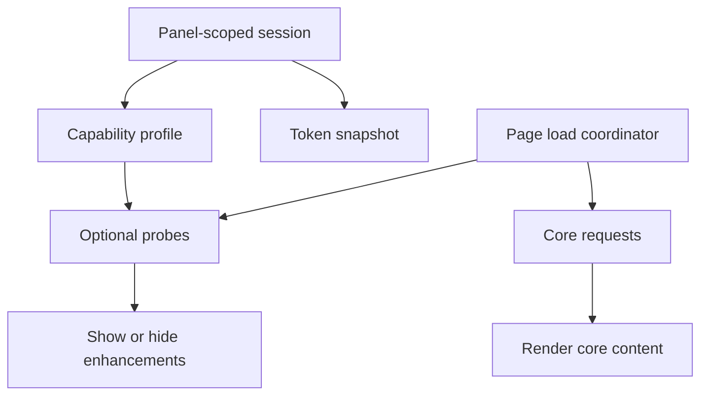

# Backend Capability Rollout

Feature Name: backend-capability-rollout
Updated: 2026-08-08

## Description

在现有后端能力页面基础上增加跨版本能力档案和首载请求编排。核心 API 保持稳定路径，增强 API 根据实际响应形成短期能力状态，使 App 与面板可以独立升降级。

## Architecture



## Components and Interfaces

- 新功能页面使用现有 `DioClient`、`ApiEndpoints`、Riverpod 和共享 Liquid Glass 组件。
- 任务视图使用独立 DTO 与 Provider，并将规则注入现有 TaskNotifier。
- 角色守卫集中在 GoRouter redirect。
- Android runtime 安装使用 POST SSE 专用客户端。
- 文件导出复用 `file_picker` 与本地保存模式。
- `AuthTokenSnapshot` 在进程内持有当前 Access Token；安全存储仍是跨进程持久化来源。
- `PanelCapabilityProfile` 以规范化面板 URL 为键，记录每个增强能力的状态、探测时间和过期时间。
- 页面加载协调器将核心请求与增强探测拆分；核心请求完成后立即提交页面状态。
- 同一页面的重复加载复用进行中的 Future；已有数据刷新采用 stale-while-revalidate。

## Data Models

```dart
enum PanelCapabilityState {
  unknown,
  supported,
  unsupported,
  temporaryFailure,
}

class PanelCapabilityEntry {
  final PanelCapabilityState state;
  final DateTime checkedAt;
  final DateTime expiresAt;
}

class PanelCapabilityProfile {
  final String normalizedServerUrl;
  final Map<String, PanelCapabilityEntry> capabilities;
}
```

- `unsupported` 使用短期负缓存，TTL 到期后允许面板升级重新启用功能。
- `temporaryFailure` 只抑制当前探测周期，不转换为永久隐藏。
- 初始能力键覆盖 `taskViews`、`panelSettings`、`systemVersion` 和 `pythonRuntimes`。
- 页面数据与能力档案使用相同的规范化面板 URL 作用域。

## Correctness Properties

- 所有管理员入口与路由同时校验角色。
- 敏感 Token 响应按后端契约保持遮罩，不回显明文。
- POST SSE 以流关闭和失败前缀共同判断结果。
- 环境变量 IDs 导出时明确包含选中的禁用项。
- 核心请求的完成不依赖增强请求的成功、失败或超时。
- 404、405 和明确不支持响应映射为 `unsupported`。
- 超时、连接失败和 5xx 映射为 `temporaryFailure`。
- Access Token 快照、Dio base URL 和能力档案始终指向同一面板作用域。
- Token 刷新期间的积压请求共享单次刷新结果并并发重放。

## Error Handling

- 页面使用统一 Loading、Empty、Error 状态。
- 网络错误通过 `extractErrorMessage` 转换并保留重试入口。
- 破坏性操作使用确认对话框。
- 增强接口失败由能力分类器处理，核心页面不显示全页错误。
- 核心接口失败保留已有数据并提供页面级重试入口。
- 面板切换使旧作用域的进行中结果失效，避免旧响应覆盖新面板状态。

## Test Strategy

- DTO 与契约解析单元测试。
- Flutter Analyze 和 Flutter Test。
- 每阶段构建 Android APK 与 iOS IPA。
- 能力分类测试覆盖 404、405、5xx、超时和成功响应。
- Provider 测试覆盖核心数据先提交、增强请求后台完成和负缓存命中。
- 认证测试覆盖 Token 快照同步、单次刷新和积压请求并发重放。
- 页面测试覆盖旧面板隐藏任务视图和 Python runtime 增强入口。
