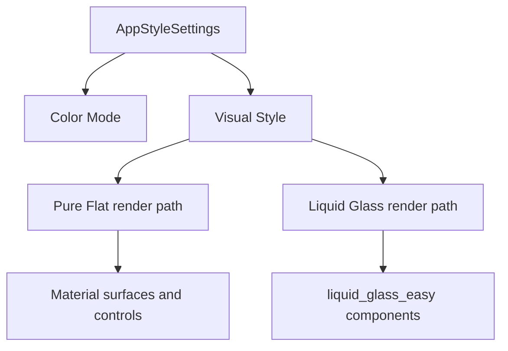

# Pure Flat 可切换视觉风格设计

Feature Name: pure-flat-visual-style
Updated: 2026-08-08

## Description

AppStyleSettings 新增 Visual Style 状态，默认值为 Pure Flat。共享 UI 组件根据 Visual Style 在 Pure Flat 与 Liquid Glass 两条渲染路径中选择一条。Pure Flat 路径仅构建 Material 与基础绘制组件；Liquid Glass 路径保留现有 `liquid_glass_easy` 实现。

Color Mode 与 Visual Style 相互独立。用户可组合 Pure Flat 浅色、Pure Flat 深色、Liquid Glass 浅色和 Liquid Glass 深色。

## Architecture



`appStyleProvider` 是视觉风格的单一状态源。主框架、页面背景和共享控件监听 Visual Style，并在组件边界进行条件分派。业务页面继续调用现有共享组件接口，减少页面级迁移范围。

## Components and Interfaces

### AppVisualStyle

在 `theme_provider.dart` 增加枚举：

```dart
enum AppVisualStyle { pureFlat, liquidGlass }
```

`AppStyleSettings` 增加 `visualStyle`，默认值为 `AppVisualStyle.pureFlat`。`AppStyleNotifier` 使用独立 SharedPreferences key 持久化枚举名称或稳定整数值，并对未知值回退到 Pure Flat。

### AppTheme

`AppTheme.light` 与 `AppTheme.dark` 接收 Visual Style。Pure Flat ThemeData 使用不透明的页面、卡片、输入、Dialog、BottomSheet、PopupMenu、SnackBar 和导航颜色。Liquid Glass ThemeData 保留现有半透明颜色与组件主题。

### MainScaffold

- Pure Flat：使用 `Scaffold`、无模糊背景图片和 Material `NavigationBar`；内容表面保持不透明。
- Liquid Glass：使用现有 `LiquidGlassScaffold`、`LiquidGlassView` 和 `LiquidGlassBottomNavBar`。
- 两条路径共享路由索引、返回键和导航回调。
- 背景图片与模糊渲染限定在 Liquid Glass 路径。

### AppBackground

- Pure Flat：显示无模糊背景原图，并以不透明共享表面承载内容；未配置图片时使用不透明 `ColoredBox`。
- Liquid Glass：保留背景图片、页面模糊和 `LiquidGlassView`。

### Shared controls

`app_card.dart` 中现有公共接口保持稳定：

- `AppCard`
- `AppListTile`
- `AppGlassIconButton`
- `AppLiquidGlassSurface`
- `AppLiquidGlassInput`
- `AppLiquidGlassToggle`
- `AppLiquidGlassButton`
- `AppLiquidGlassChoiceChip`
- `AppLiquidGlassActionChip`
- `AppLiquidGlassInputChip`
- `AppLiquidGlassDialogActions`

每个组件读取 `appStyleProvider.select((value) => value.visualStyle)`。Pure Flat 分支使用 `Material`、`InkWell`、`Container`、`Switch`、Material Buttons 和 Material Chips；Liquid Glass 分支保留原实现。现有类名暂时保持，避免大范围业务页面重命名。

### Direct package usages

以下页面的直接 `LiquidGlassToggle` 或 `LiquidGlassSlider` 调用迁移到共享的风格感知组件：

- Theme Settings
- Local Notification Settings
- App Lock Settings

业务页面完成迁移后，`liquid_glass_easy` 导入仅保留在共享渲染实现文件。

### Theme Settings

页面顶部增加“视觉风格”区域，提供“Pure Flat”和“Liquid Glass”两个单选卡片。背景图片适用于两种风格；模糊强度仅适用于 Liquid Glass。Pure Flat 激活时隐藏模糊强度并展示无模糊说明，已保存的模糊配置继续保留供再次启用 Liquid Glass。

## Data Models

```dart
class AppStyleSettings {
  final ThemeMode themeMode;
  final AppVisualStyle visualStyle;
  final String? backgroundImagePath;
  final double blurIntensity;
}
```

持久化键：

- `theme_mode`: 现有 Color Mode。
- `visual_style`: 新增 Visual Style。
- `background_image_path`: 现有 Liquid Glass 背景图片。
- `blur_intensity`: 现有 Liquid Glass 模糊强度。

## Correctness Properties

1. 缺少或无法解析 `visual_style` 时，状态值为 `pureFlat`。
2. Pure Flat 共享组件子树中不存在 `LiquidGlassLens`、`LiquidGlassView`、`LiquidGlassScaffold`、`LiquidGlassBottomNavBar`、`LiquidGlassSlider`、`LiquidGlassToggle` 或 `LiquidGlassButton`。
3. Liquid Glass 分支继续通过 `liquid_glass_easy` 公共 API 构建。
4. Visual Style 更新不会修改 ThemeMode、背景图片路径或模糊强度。
5. ThemeMode 更新不会修改 Visual Style。
6. Pure Flat 的共享内容表面颜色保持完全不透明。
7. Pure Flat 可显示无模糊背景原图，且不创建 `BackdropFilter`。

## Error Handling

- SharedPreferences 读取失败时继续使用默认 Pure Flat 和系统 Color Mode。
- `visual_style` 值未知时回退 Pure Flat，并在下一次用户选择时覆盖该值。
- Liquid Glass 背景图片失效时使用当前主题页面颜色。
- 风格切换通过 Provider 状态更新触发同步重建，持久化失败不阻塞当前会话切换。

## Test Strategy

- 单元测试 `AppStyleSettings` 默认值与 `copyWith` 独立更新。
- SharedPreferences mock 测试 Fresh Install、Pure Flat 和 Liquid Glass 的加载与持久化。
- Widget 测试 Pure Flat 与 Liquid Glass 下的 AppCard、Surface、Button、Toggle 和 MainScaffold 类型。
- Widget 测试主题设置页风格切换及 Liquid Glass 专属设置显隐。
- 浅色和深色模式检查页面、卡片、输入、Chip、Dialog 和底部导航。
- Android 与 iOS Profile 模式检查主列表持续滚动时的 Raster 时间与 GPU 使用趋势。
- 执行 `flutter analyze`、`flutter test`、Android Release APK 和 iOS 无签名 Release 构建。

## References

[^1]: `lib/core/theme/theme_provider.dart` - 当前主题与背景设置状态。
[^2]: `lib/shared/widgets/main_scaffold.dart` - 当前主液态玻璃框架。
[^3]: `lib/shared/widgets/app_background.dart` - 当前二级页面液态玻璃背景。
[^4]: `lib/shared/widgets/app_card.dart` - 当前共享液态玻璃控件。
[^5]: `.monkeycode/docs/UI_RENDERING_REGRESSION_GUIDE.md` - UI 渲染回归经验与检查项。
