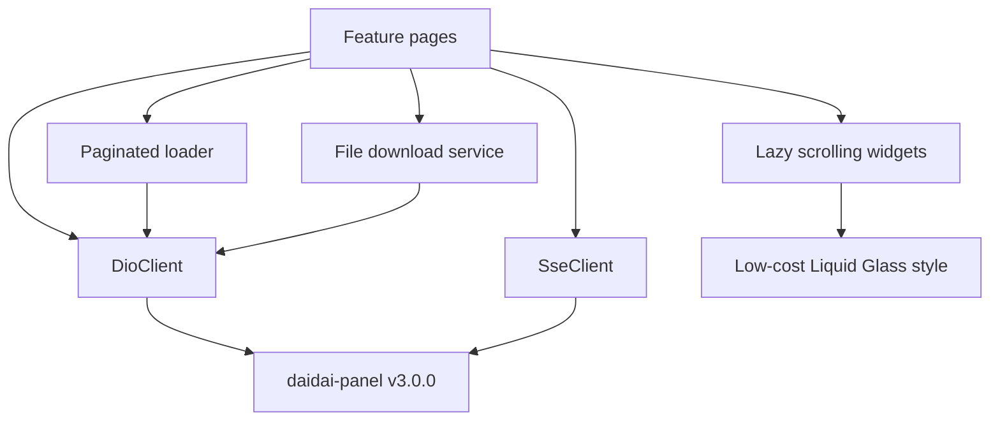

# v3 Stability, Capability and Performance

Feature Name: v3-stability-performance
Updated: 2026-08-08

## Description

本设计一次性交付已确认缺陷修复、daidai-panel v3.0.0 缺口、已排除候选的合理清理，以及保留完整 Liquid Glass 视觉的滚动性能优化。

## Architecture



`SseClient` 维护单连接 generation、终态标记和重连决策。分页页面采用“请求目标页，成功后提交页码”的事务式更新。原始日志下载先请求票据，再复用文件下载服务保存后端返回的文件。列表继续使用 Liquid Glass，并统一启用滚动卡片低成本样式与惰性构建。

## Components and Interfaces

### SseClient

- 将行字段解析提取为可测试的纯函数。
- 接受 `field:value` 与 `field: value`。
- 在单连接作用域记录业务终态。
- 业务终态关闭连接；reconnect 事件和异常 EOF进入重连。
- 日志密集调用方通过短周期缓冲批量提交 UI。

### Pagination

- 下一页计算使用 `targetPage = currentPage + 1`。
- 网络请求成功后更新 `currentPage`。
- 失败后保留当前页，暴露错误或重试操作。
- 辅助全量列表使用合法 `page_size=100`；任务和环境变量优先使用后端 `all=1`。

### Raw Log Download

- 新增执行日志与任务日志文件 ticket endpoint。
- ticket DTO 读取 `url`、`filename`、`expires_at`。
- 下载 URL 支持后端返回绝对 URL和相对 URL。
- 文件保存复用现有 file picker/path provider 约定，采用流式写入。

### Session Presentation

- 会话行读取 `client_type`、`client_type_label`、`client_name`。
- client type 映射稳定图标，未知类型使用设备图标。
- user agent 保留为次级诊断信息。

### Platform Tokens

- 页面状态增加错误文本和 mutation busy 状态。
- load 使用 `try/catch/finally` 与 mounted 检查。
- CRUD 操作统一捕获后端错误并显示 `AppGlassNotice`。

### Scrolling Performance

- 长列表保留 `ListView.builder`、`SliverList` 或 `ReorderableListView.builder`。
- 长列表中的 `AppCard` 统一设置 `stableForScrolling: true`。
- 高频日志流批量 setState，避免每行触发整页重建。
- Riverpod 页面使用 `.select` 订阅局部状态。
- 固定尺寸或可预测行高的位置设置 `itemExtent` 或 `prototypeItem`。
- 保留玻璃层级、色彩、圆角和交互视觉。

## Data Models

```dart
class RawLogTicket {
  final String url;
  final String filename;
  final DateTime? expiresAt;
}
```

分页状态遵循以下字段：

```dart
class PageState<T> {
  final List<T> items;
  final int page;
  final int total;
  final bool loading;
  final String? error;
}
```

## Correctness Properties

- 每个 SSE generation 最多存在一个活动连接和一个重连计时器。
- 每个业务终态事件对调用方最多投递一次。
- 页码始终表示最后一个成功合并到列表的页面。
- 下载票据仅用于后端返回的绑定资源 URL。
- 异步回调仅在 mounted 且请求 generation 有效时更新页面。
- 性能优化保持业务数据、操作入口和视觉层级不变。

## Error Handling

- SSE 认证失败沿用 Refresh Token single-flight；刷新失败清理会话。
- 分页错误保留现有数据并提供重试。
- ticket 和下载错误使用 `extractErrorMessage`，保存失败展示目标文件错误。
- 平台令牌与辅助列表使用 `AppAsyncState` 或同等 Loading、Empty、Error 状态。
- 生命周期竞争通过 mounted 和 request generation 双重隔离。

## Test Strategy

- SSE 解析器：可选空格、CRLF、多行 data、注释、业务终态、reconnect、异常 EOF。
- 分页：首次加载、下一页成功、下一页失败、重复触发、刷新覆盖。
- DTO：raw ticket 包装与直接响应、会话字段缺失回退。
- Widget：平台令牌加载失败与重试、会话分类展示。
- Profile：使用 Flutter DevTools 检查任务、环境变量、日志、依赖、订阅连续滚动；记录 build/raster frame 时间和 rebuild 统计。
- 工具链门禁：`dart format`、`flutter analyze`、`flutter test`、Android 构建和 iOS 构建。

## References

- `.monkeycode/docs/UPSTREAM_FEATURE_AND_BUG_CANDIDATES.md`
- `lib/core/network/sse_client.dart`
- `lib/features/security/views/security_page.dart`
- `lib/features/openapi/views/open_api_page.dart`
- `lib/features/tasks/views/task_form_page.dart`
- `lib/shared/widgets/app_card.dart`
