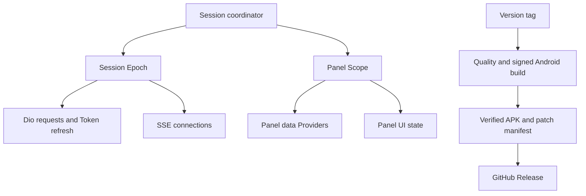

# Upstream Parity Hardening

Feature Name: upstream-parity-hardening
Updated: 2026-08-09

## Description

本设计在现有 Riverpod、Dio、GoRouter 和跨版本能力降级架构上修复上游对比确认的问题。改造优先保持现有公共接口，通过纯函数、Session Epoch、Panel Scope 和统一 SSE 协议状态增强可靠性。

## Architecture



## Components and Interfaces

- `AuthSessionEpoch` provides the current epoch and advances at authentication boundaries.
- `AuthInterceptor` stamps requests with Panel Scope and Session Epoch and rejects stale responses.
- `TokenRefreshCoordinator` performs one refresh per epoch and validates the epoch before returning results.
- `SseDecoder` parses standard SSE fields; `SseClient` owns resume IDs, duplicate suppression and reconnect backoff.
- Task form normalizes Cron input as ordered non-empty lines and writes both compatibility and complete-list fields.
- Panel UI storage derives stable scoped keys from normalized Panel URLs.
- Formal Release workflow owns signing, patch generation, update manifest generation and asset publication.

## Data Models

```dart
class SessionStamp {
  final String panelScope;
  final int sessionEpoch;
}

class SseEvent {
  final String? event;
  final String data;
  final String? id;
  final bool hasExplicitId;
  final String? lastEventId;
}
```

## Correctness Properties

- Session Epoch is monotonic during one process lifetime.
- A stale epoch cannot write Tokens, retry requests, emit SSE callbacks or update authentication state.
- Multi-Cron serialization preserves order, duplicates and every non-empty expression.
- Panel-scoped Provider and UI state cannot cross normalized Panel Scope boundaries.
- Formal Android assets originate from the same verified signed APK.
- Event IDs are opaque strings and duplicate suppression remains bounded.

## Error Handling

- Stale session results become cancellation outcomes and remain silent during navigation.
- Old Panel data remains visible during refresh and an inline retry error communicates failure.
- Raw-log ticket expiry permits one ticket renewal and one download retry.
- Unsupported optional endpoints preserve core page behavior through capability fallback.
- Formal Release fails before publication when signing or asset validation fails.

## Test Strategy

- Pure contract tests cover Cron, task-view response, unknown enum and UI key normalization.
- Authentication tests cover epoch advancement, stale response rejection and concurrent refresh.
- SSE tests cover chunk decoding, ID resume, retry values, duplicate IDs and bounded backoff.
- Raw-log tests cover expiry and renewal decisions.
- CI validates workflow formatting, Flutter analysis, tests and platform builds.

## References

- Dumb-Panel-APP releases: https://github.com/linzixuanzz/Dumb-Panel-APP/releases
- Existing stability specification: `../2026-08-08-v3-stability-performance/`
- Existing capability specification: `../2026-07-23-backend-capability-rollout/`
- Existing Android update specification: `../2026-07-23-android-delta-update/`
